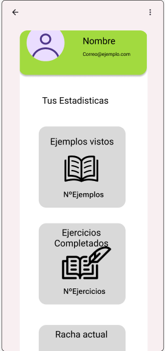

<strong> Desarrolladores del proyecto: Gonzalo Martinez, Javier Retuerta y Guillermo Leal </strong>
 
<strong> Nombre del proyecto: MathStorm </strong>
 
<strong> Desarrollado en Java desde AndroidStudio </strong>
 

El proyecto se trata de una aplicación de uso principalmente educativo, su objetivo es ayudar a 
gente de todas las edades a entender y mejorar en el ambito matemático.

La aplicación tratara de dos secciones distintas, la primera es de ejercicios, antes de emepezar a 
resolver los problemas se elegiran que formulas quieres que se usen para los estos 
y una vez hecho eso se enseñaran problemas de manera aleatoria para que no se 
repitan los mismos.

La segunda sección trata de el aprendizaje de las formulas matemáticas, esta enseñara como hacer un
problema especifico y te lo mostrara con ejemplos y explicaciones para que se entienda de la mejor
manera posible.

<strong>-------------------------------------------------------------------------------------------</strong>
## Login y Registro
Paginas simples las cuales permiten iniciar sesion y/o registrarse para poder acceder a la aplicación

## Pagina principal
Pagina con dos opciones, ejemplos y ejercicios que te llevaran a esa pestaña especifica

## Ejemplos
Pagina con la lista de los ejemplos con una pequeña descripcion, al darle a las opciones te llevara
al ejemplo elegido.

## Ejercicios
Pagina donde se daran los ejercicios a resolver con un boton de verificacion y uno de mostrar el 
siguiente ejercicio

## Perfil
Pagina donde ver tu perfil o el de otras personas donde se mostrara los ejemplos vistos, ejercicios
hechos y racha de ejercicios

