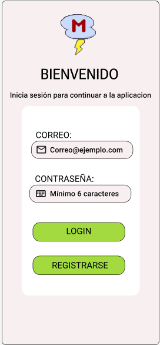
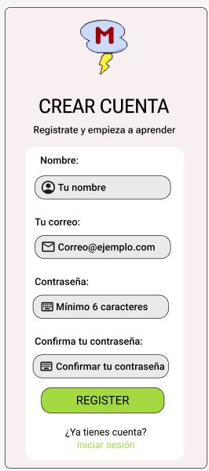
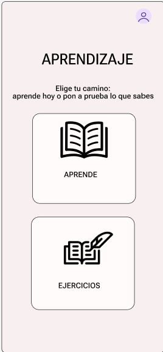
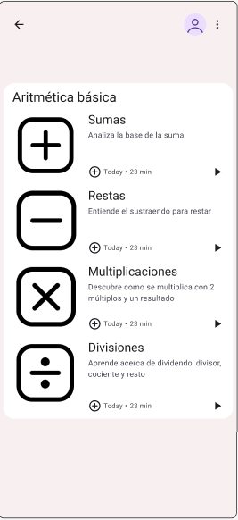
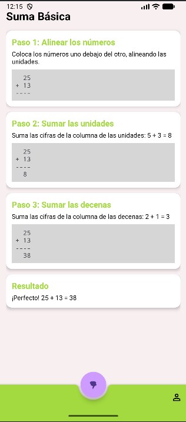
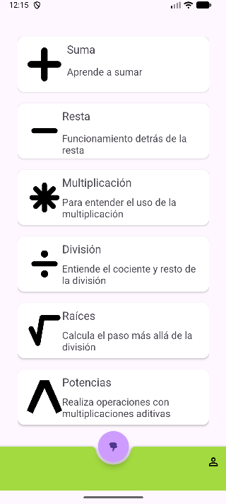
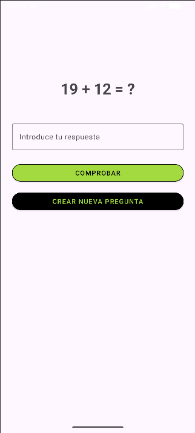
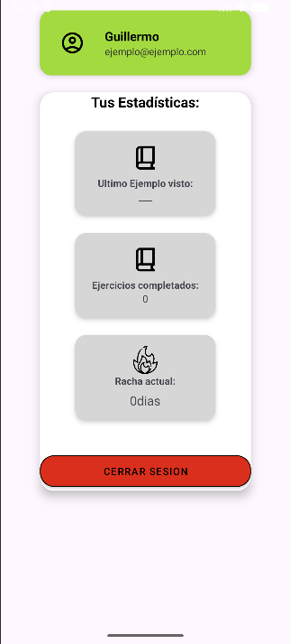
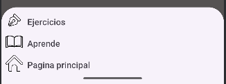

<strong> Desarrolladores del proyecto: 
[Gonzalo Martinez](https://github.com/GonzaloMarCa) 
[Javier Retuerta](https://github.com/javirg22)
[Guillermo Leal](https://github.com/Guillermo-Leal)
</strong>
 
<strong> Nombre del proyecto: MathStorm </strong>
 
<strong> Desarrollado en Java desde AndroidStudio </strong>
 

El proyecto se trata de una aplicación de uso principalmente educativo, su objetivo es ayudar a 
gente de todas las edades a entender y mejorar en el ambito matemático.

La aplicación tratara de dos secciones distintas, la primera es de ejercicios, antes de emepezar a 
resolver los problemas se elegiran que formulas quieres que se usen para los estos 
y una vez hecho eso se enseñaran problemas de manera aleatoria para que no se 
repitan los mismos.

La segunda sección trata de el aprendizaje de las formulas matemáticas, esta enseñara como hacer un
problema especifico y te lo mostrara con ejemplos y explicaciones para que se entienda de la mejor
manera posible.

<strong>-------------------------------------------------------------------------------------------</strong>
## Login y Registro
Estas son las paginas de inicio de sesion y registro que te permitiran tanto iniciar tu sesión si te
registraste antes o registrarte si eres un usuario nuevo.

## Pagina principal
Pagina de bienvenida de la aplicación, en esta se encuentran dos botones y el bab, estos botones te 
llevaran a las paginas indicadas por cada uno, o ejemplos o ejercicios.

## Ejemplos
En esta pagina encontraremos los distintos ejemplos de los ejercicios que podemos encontrar dentro 
de la aplicación, estos van desde sumas hasta potencias.

                    
## Ejemplo de suma
Esta es la página de ejmplo en este caso de la suma, se tiene una explicación de como hacerla junto
a un ejemplo, tambien tenemos el BaB por lo cual podemos ir directamente de esta pagina a los
ejercicios.

## Ejercicios
Esta es la pagina de ejercicios, aqui se pueden ver todas las opciones que proporciona la aplicación
desde sumas simples hasta las potencias.

## Ejercicio Suma
Esta es la pagina de ejercicio de la suma  en este caso son ejercicios de suma con un boton para 
ver si tu respuesta es la correcta y un boton para generar una nueva suma.    

## Perfil                                                             
Esta es tu pagina de perfil personal, en ella podras ver dcual es el ultimo ejemplo al que has
accedido y podras ver cuantos ejercicios has hecho junto a tu racha diaria que se va actualizando
cuando terminas tu primer ejercicio del dia.

                                               
## BaB (Bottom app Bar)
En muchas pantallas podemos ver una barra abajo con dos botones, uno morado grande con el logo de la
aplicación en negro y otro que te llevará al perfil, este boton grande es nuestro Fab que te abrira
la siguiente ventana permitiendote acceder a las paginas de la app de manera sencilla.

