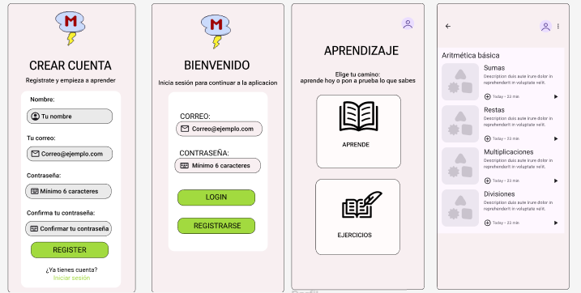

## Desarrolladores del proyecto: Gonzalo Martinez, Javier Retuerta y Guillermo Leal
## Nombre del proyecto: MathStorm
## Desarrollado en Java desde AndroidStudio

El proyecto se trata de una aplicacion de uso principalmente educativo, su objetivo es ayudar a 
gente de todas las edades a entender y mejorar en el ambito matematico.

La aplicacion tratara de dos secciones distintas, la primera es de ejercicios, antes de emepezar a 
resolver los problemas se elegiran que formulas quieres que se usen para los estos 
y una vez hecho eso se enseñaran problemas de manera aleatoria para que no se 
repitan los mismos.

La segunda seccion trata de el aprendizaje de las formulas matematicas, esta enseñara como hacer un
problema especifico y te lo mostrara con ejemplos y explicaciones para que se entienda de la mejor
manera posible.

